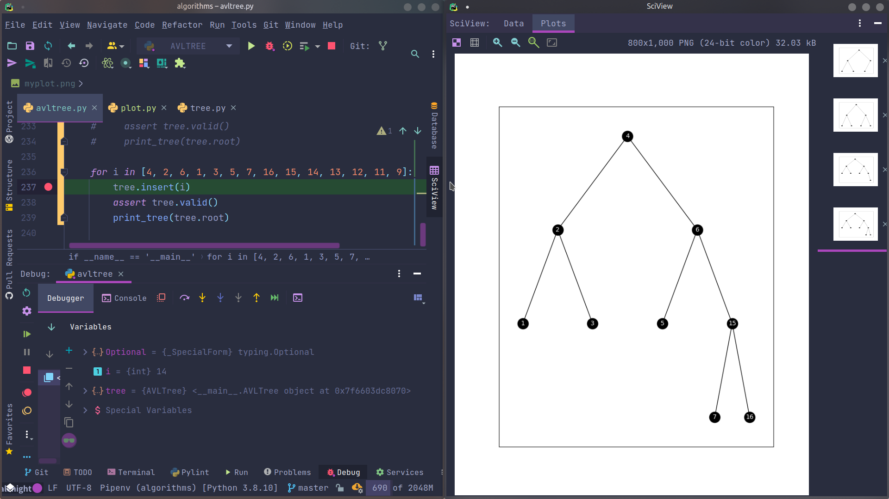

一些数据结构与算法的 Python 实现以及 leetcode 部分算法实现

树结构可以使用 plot 查看视图, 用于 DEBUG

## 算法:

1. 快排
2. 堆排
3. 冒泡排序
4. 插入排序
5. 归并排序

## 数据结构:

1. 二叉树(前序,中序,后续遍历 迭代法与递归法)
2. 二叉搜索树
3. 二叉平衡树

TODO:

1. 二叉堆
2. 红黑树
3. 跳表
4. B 树
5. B+ 树
6. 希尔排序
7. 桶排序

参考资料:

1. https://www.programiz.com/
2. https://leetcode-cn.com/
3. 数据结构与算法分析 c 语言描述
