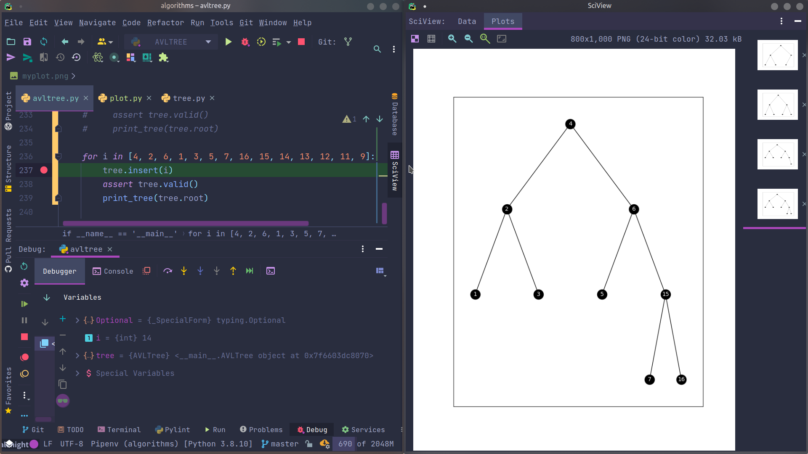
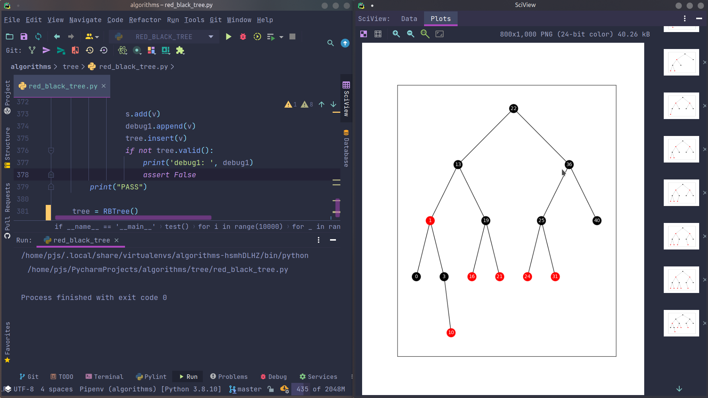

一些数据结构与算法的 Python 实现以及 leetcode 部分算法实现

 
 
树结构可以使用 plot.py 的 print_tree 查看视图, 用于 DEBUG:

## 算法:

1. 快排
2. 堆排
3. 冒泡排序
4. 插入排序
5. 归并排序
6. 快速选择

## 数据结构:

1. 二叉树(前序,中序,后续遍历 迭代法与递归法)
2. 二叉搜索树
3. AVL 树
4. 二叉堆
5. 红黑树 

TODO:

1. 伸展树
2. 跳表
3. B 树
4. B+ 树
5. 希尔排序
6. 桶排序
7. 并查集与各类图算法

参考资料:

1. https://www.programiz.com/
2. https://leetcode-cn.com/
3. 数据结构与算法分析 c 语言描述
